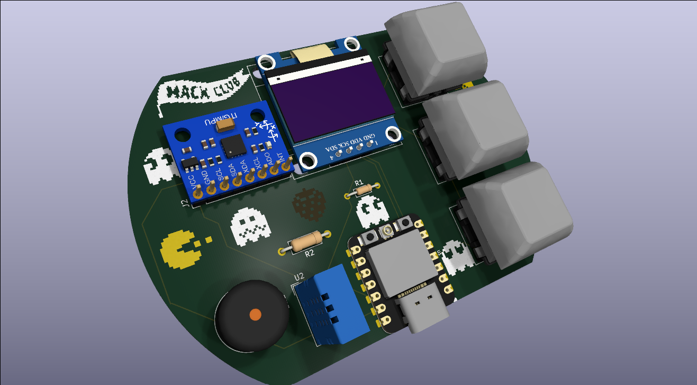

# Unghost
> A pocket-sized reminder device that nudges you to reach out to the people you haven't talked to in a while.

## Why I made this
Isolation is too common in today's culture. With everyone rushing to the next task of a busy life, everyday human contact can be left all but forgotten. This little guy fixes that, and makes keeping in touch harder to forget.

## What it does

- Tracks how long it's been since you contacted each person
- Chimes with a little "waka waka" when someone is overdue
- Shows the contacts, days since last contact, and a "Call (So and Such)!" banner on an OLED
- Three buttons: **Next contact**, **I contacted them**, **Snooze**
- Shows room temperature and humidity
- *(PLANNED)* Syncs contacts and time from your phone over Bluetooth LE

## Hardware

| Part | Purpose |
|---|---|
| Seeed XIAO ESP32-C3 | Microcontroller with built-in BLE |
| 0.96" SSD1306 OLED (I2C) | Display |
| MPU6050 breakout | Motion sensing (PLANNED: tap/flip to snooze) |
| DHT11 | Temperature and Humidity |
| Passive piezo buzzer | Reminder chimes |
| 3× Cherry MX Switches | User Input |
| 10 kΩ resistor (R1) | DHT11 data pull-up |
| 100 Ω resistor (R2) | Buzzer series resistor |

## Pinout
| XIAO Pin | Connected to |
|---|---|
| D1 | DHT11 data |
| D2 | SW1 (next contact) |
| D3 | SW2 (I contacted them) |
| D4 | SW3 (snooze) |
| D5 | I2C SCL |
| D6 | I2C SDA |
| D10 | Buzzer (via 100 Ω) |
